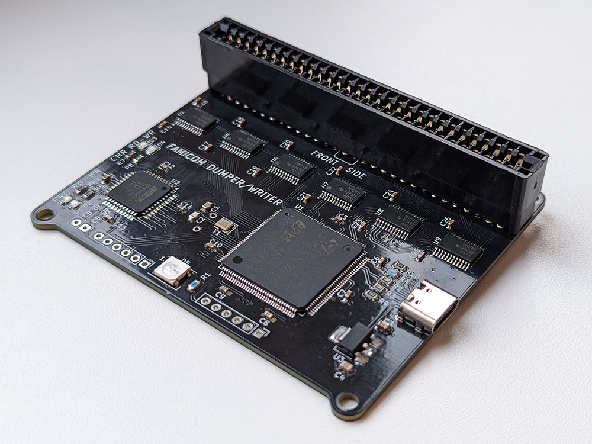
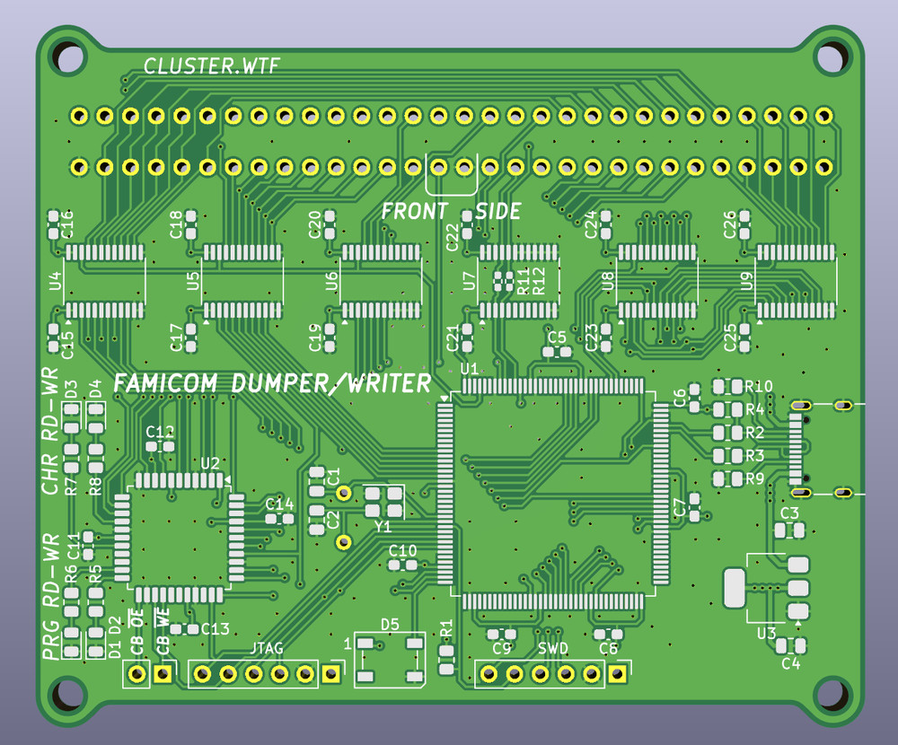

### Famicom Dumper - дампер/программатор для картриджей Famicom/Dendy

Цель проекта — создание идеального симулятора шины данных Famicom. Он использует очень точную симуляцию цикла M2 и FSMC для доступа к памяти PRG и CHR. Кроме того, этот дампер имеет высокую скорость чтения/записи больших многоигровок.  
  
Главные отличия данного форка от оригинального проекта: полностью изменена трассировка; выводные светодиоды заменены на SMD; есть возможность установки на выбор THT или SMD версии кварцевого резонатора; убран разъем NES.  
  
В папке **STM32-Dumper** находится KiCad проект и гербер файлы для производства.  
  

  
Проект создан в [**KiCad 9**](https://www.kicad.org/).

### Сборка

#### BoM и Schematic
[BoM](Dumper-Docs/Dumper-BOM.jpg)  
  
[Schematic](Dumper-Docs/STM32-Dumper-Schematic.pdf)

Выберите какой кварцевый резонатор ставить - SMD **Y1**, или THT **Y2**.  
Вместо шифтера **U7** можно установить два резистора **R11, R12**.  

#### Firmware
В папке **Dumper-Firmware** находятся файлы для прошивки STM32 и EPM3064:  
**FamicomDumper.pof** - файл для прошивки EPM3064 с помощью USB-Blaster. Исходники находятся в архиве Dumper-CPLD.zip  
**FamicomDumperBootloader.bin** - бутлоадер для STM32, для прошивки можно использовать программу STM32 ST-LINK Utility и дешёвый донгл ST-LINK. Вручную укажите адрес для записи **0x08000000**.  
**FamicomDumper.bin** - основная программа для STM32. Вручную укажите адрес для записи **0x08040000**.  

### Software

[https://github.com/ClusterM/famicom-dumper-client](https://github.com/ClusterM/famicom-dumper-client)

#### P.S.

Мне не очень нравится идея преобразования сигналов до уровня 5В. Да, для старых картриджей это нормально, но современные дешевые многоигровки используют чипы с питанием 3.3В и в подавляющем большинстве случаев не имеют преобразователей уровней. Поэтому 5В сигналы для них, мягко говоря, не полезны. Как вариант, использовать 74LVC245A вместо 74LVC8T245.